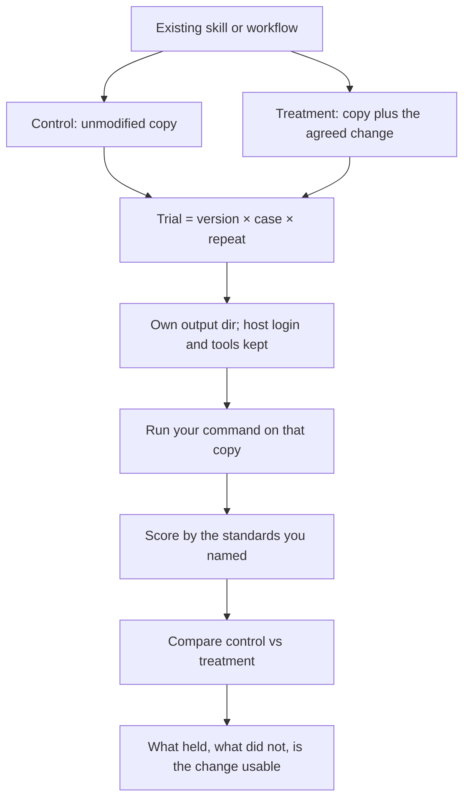

# AgentLab

[English](README.md) · [中文](README.zh.md)

On an existing Skill or agent workflow: talk through a change first, then compare it with the current version by the standards you care about. Or skip the change and just run one version several times. Not for writing a new SKILL.md from scratch.

AgentLab is a standard skill. Copy [`skills/agentlab/`](skills/agentlab/) into your coding agent. The CLI lives in that folder (`scripts/cli.py`); the agent runs it. You do not install a global `agentlab` command.

MIT. Python 3.11+ on the machine is enough. The skill prepares its own interpreter (`scripts/ensure_python.py`); do not `pip install` into the system Python.

macOS and Linux only.

## How an experiment works

The source tree is not edited. Each version is a copy. Each trial is one version × one case × one repeat, run in its own output directory with the command you already use. Scores come only from that run.



## How you use it

1. Copy the whole `skills/agentlab/` directory into your agent’s skills folder (everything next to `SKILL.md`).
2. Have Python 3.11+ on the machine.
3. In chat, say which directory you want to change or to run.

For example:

> I want to improve news search in `~/code/scutio/skills/scutio-trading`: less time and spend, without dropping facts that would change a decision.

The agent should first propose a concrete change. After you agree, it lays out the comparison (control vs treatment), asks only what it still needs (which command already works on this machine, how to pass the prompt), then runs it. There is no default time or spend cap.

If you only want to run the current version several times, say that; it should skip inventing a change.

Scores are whatever that run wrote down. To try another change, say which one. A directory without `SKILL.md` works the same way: point the command at your program.

What the agent actually runs:

```text
python3 <skills/agentlab>/scripts/ensure_python.py
<that interpreter> <skills/agentlab>/scripts/cli.py brief --exp <experiment-dir> --confirm-criteria
<that interpreter> <skills/agentlab>/scripts/cli.py run --exp <experiment-dir> --gate
<that interpreter> <skills/agentlab>/scripts/cli.py report --exp <experiment-dir>
```

## What’s in the skill

```text
skills/agentlab/
  SKILL.md                 briefing instructions
  scripts/cli.py           command entry
  scripts/ensure_python.py isolate a 3.11+ interpreter
  scripts/agentlab/        implementation
  references/contract.md  experiment.yaml shape
  references/trading.md   only when the target is a trading skill
```

The Skill under test is not copied into your global skills folder. If the model should follow a Skill, the prompt tells it to read `${program_root}/SKILL.md`.

After a run, the experiment directory has `experiment.yaml`, `criteria.md`, the candidates, and `report.md`. Unless you choose another path, that directory is under `~/.agentlab/experiments/`. Those files stay on your machine (the repo does not publish example experiment trees).

## Working on this repo / CI

From the repository root:

```bash
python3.12 -m venv .venv
source .venv/bin/activate
pip install -e ".[dev]"
pytest -q
```

`pip install -e .` also puts `agentlab` on PATH; it is the same code as `scripts/cli.py`. After briefing, `experiment.yaml` contains `criteria.sha256`.

`--gate` exit codes: `0` the required checks held, `1` something required did not hold so the change is not usable, `2` the contract is invalid, `3` a cap you set stopped an incomplete run.

| Subcommand | What it does |
|---|---|
| `brief` | Check the contract. `--confirm-criteria` writes `criteria.sha256`. |
| `run [--gate]` | Isolate, run the command, score; `--gate` fails if a required check does not hold. |
| `report` | Write `report.md`. |
| `promote --only-variant ID` | Update `promotion.json`. |

Not included: Windows, Docker isolation, an HTML report.
