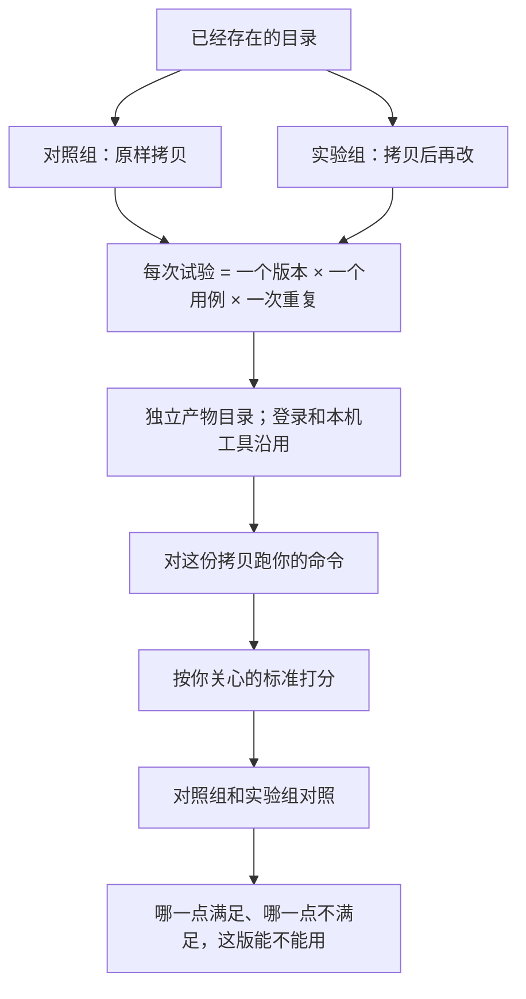

# AgentLab

[English](README.md) · [中文](README.zh.md)

对已经存在的 Skill 或工作流：先一起商量怎么改，谈妥后再按你关心的标准比较改前和改后。也可以不改，只把现在的版本跑几次看稳不稳。不是从零写一份新的 SKILL.md。

这是一个标准 skill：把 [`skills/agentlab/`](skills/agentlab/) 拷进你的 coding agent 即可。CLI 在 skill 里面（`scripts/cli.py`），对话里的 agent 会自己执行它。不必再装一个全局的 `agentlab` 命令。

MIT。本机有 Python 3.11+ 即可。解释器由 skill 自己准备（`scripts/ensure_python.py`），不要往系统 Python 里 `pip install`。

仅 macOS / Linux。

## 实验怎么做

不改你的源目录。每个版本都是一份拷贝。每次试验是「一个版本 × 一个用例 × 一次重复」，在自己的产物目录里，用你本机已经能登录的命令跑。分数只认这次跑出来的结果。



## 你怎么用

1. 把整个 `skills/agentlab/` 拷到 agent 的 skills 目录（和这份 `SKILL.md` 同级的文件夹都要带上）。
2. 本机有 Python 3.11+。
3. 在对话里说要改或要跑哪个目录。

例如：

> 想优化 `~/code/scutio/skills/scutio-trading` 的新闻搜索：时间和花费降下来，会改变判断的事实不能漏。

agent 应先给出一版具体改法。你点头之后，再写出对照计划（对照组 / 实验组），只补还缺的事实（本机哪条已经能登录的命令、任务说明怎么传），然后去跑。默认不设时长或花费上限。

如果只想把现在的版本跑几次，直接说；它不应再发明一处改动。

分数以这次跑出来的结果为准。想再改一处对比，直接说要试哪一处。没有 `SKILL.md` 的目录也可以：启动命令指到你的程序即可。

Agent 实际执行的是：

```text
python3 <skills/agentlab>/scripts/ensure_python.py
<上面给出的解释器> <skills/agentlab>/scripts/cli.py brief --exp <实验目录> --confirm-criteria
<上面给出的解释器> <skills/agentlab>/scripts/cli.py run --exp <实验目录> --gate
<上面给出的解释器> <skills/agentlab>/scripts/cli.py report --exp <实验目录>
```

## 这个 skill 里有什么

```text
skills/agentlab/
  SKILL.md                 给 agent 的说明
  scripts/cli.py           命令入口
  scripts/ensure_python.py 准备 3.11+ 解释器
  scripts/agentlab/        实现
  references/contract.md  契约怎么写
  references/trading.md   仅当测交易 skill 时用
```

被测的那个 Skill 不会被拷进你的全局 skills。要让模型按 Skill 做事，prompt 里写阅读 `${program_root}/SKILL.md`。

实验跑完后，目录里会有 `experiment.yaml`、`criteria.md`、候选和 `report.md`。你没另指定的话，写在 `~/.agentlab/experiments/` 下。这些文件留在你本机（仓库不发布示例实验树）。

## 开发这个仓库 / CI

在仓库根目录：

```bash
python3.12 -m venv .venv
source .venv/bin/activate
pip install -e ".[dev]"
pytest -q
```

`pip install -e .` 也会在 PATH 里提供 `agentlab`，和 `scripts/cli.py` 是同一套代码。`brief --confirm-criteria` 之后 `experiment.yaml` 里会有 `criteria.sha256`。

`--gate` 退出码：`0` 必须满足的都满足，`1` 有必须满足的没满足所以这版不能用，`2` 契约不合法，`3` 你设了上限并且到了、实验没跑完。

| 子命令 | 作用 |
|---|---|
| `brief` | 检查契约。`--confirm-criteria` 写入 `criteria.sha256`。 |
| `run [--gate]` | 隔离、执行命令、打分；`--gate` 在必须满足的没满足时失败。 |
| `report` | 写出 `report.md`。 |
| `promote --only-variant ID` | 更新 `promotion.json`。 |

当前没有 Windows、Docker 隔离和网页报告。
